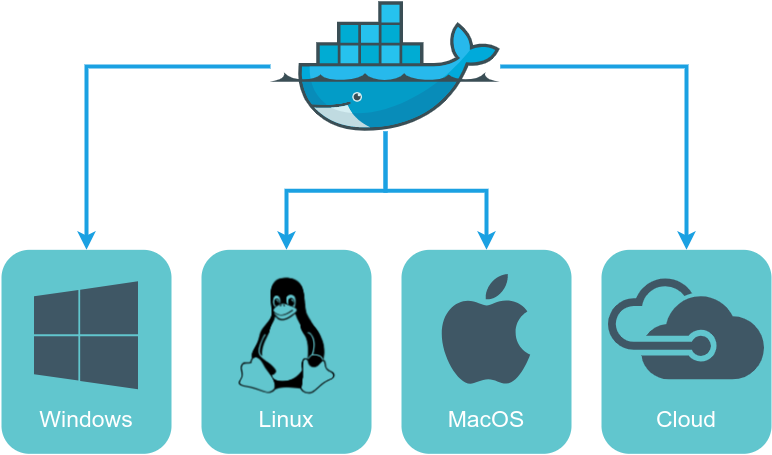
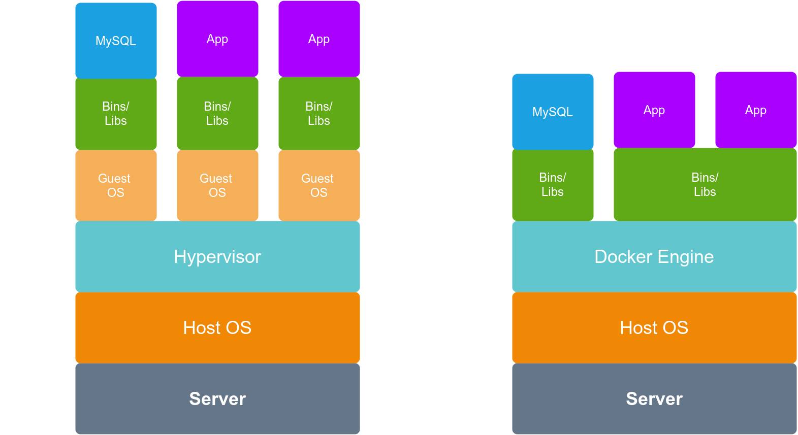

# Введение в **Docker**

---
@snap[north span-90 text-center]
### Что такое **Docker**?
@snapend

@snap[south span-80]

@snapend


---

@title[Add A Little Imagination]

@snap[north-west span-50 text-center]
#### **Docker**
@snapend
@snap[west span-90]
@ul[list-spaced-bullets text-06]
- Docker — программное обеспечение с открытым исходным кодом, применяемое для разработки, тестирования, доставки и запуска веб-приложений в средах с поддержкой контейнеризации. Он нужен для более эффективного использование системы и ресурсов, быстрого развертывания готовых программных продуктов, а также для их масштабирования и переноса в другие среды с гарантированным сохранением стабильной работы.
- Изначально Docker использовал LinuX Containers(LXC)
- Сейчас Docker использует runC (libcontainer)
@ulend
@snapend


---

@title[Add A Little Imagination]

@snap[north-west span-50 text-center]
#### Где работает **Docker**?
@snapend

@snap[south span-80]

@snapend

---

@title[Add A Little Imagination]

@snap[north-west span-50 text-center]
#### VM vs Container
@snapend

@snap[west span-55]
@ul[list-spaced-bullets text-06]
- VM == приложение (связанные библиотеки. исходный код), OS, CPU, RAM, HDD.
- Container == изолированное пространство, приложение (связанные библиотеки. исходный код)
@ulend
@snapend

@snap[east span-45]

@snapend

@snap[south span-100 bg-black fragment]
@img[shadow](assets/img/vm-vs-container.png)
@snapend


---

@title[Add A Little Imagination]

@snap[north-west span-50 text-center]
#### Что такое ** Docker Engine**?
@snapend

@snap[west span-55]
@ul[list-spaced-bullets text-06]
- Docker Engine («Движок» Docker) — ядро механизма Докера. «Движок» отвечает за функционирование и обеспечение связи между основными Docker-объектами (реестром, образами и контейнерами)..
@ulend
@snapend

---

@title[Add A Little Imagination]

@snap[north-west span-50 text-center]
#### Элементы **Docker Engine** 
@snapend

@snap[west span-55]
@ul[list-spaced-bullets text-06]
- Сервер выполняет инициализацию демона (фоновой программы), который применяется для управления и модификации контейнеров, образов и томов.
- REST API — механизм, отвечающий за организацию взаимодействия Докер-клиента и Докер-демона.
- Клиент — позволяет пользователю взаимодействовать с сервером при помощи команд, набираемых в интерфейсе (CLI).
@ulend
@snapend

@snap[east span-45]

@snapend

---


@title[Add A Little Imagination]

@snap[north-west span-50 text-center]
#### Преимущества и особенновсти
@snapend

@snap[west span-55]
@ul[list-spaced-bullets text-06]
- Изолированность
- Портативность
- Быстрая доставка и развёртывание приложений
- open-source
- cross-platform
- Написан на Go
@ulend
@snapend

@snap[east span-35]

@snapend


---

@title[Add A Little Imagination]

@snap[north-west span-50 text-center]
#### Области применения
@snapend

@snap[west span-55]
@ul[list-spaced-bullets text-06]
- Контейнеризация Web-приложений
- Построение отказоустойчивых систем
- Быстрая доставка и развёртывание приложений
- open-source
- cross-platform
- Написан на Go
@ulend
@snapend


---

@snap[north span-90 text-center]
### **Тренды**
@snapend

@snap[south span-80]

@snapend


---


@snap[north span-90 text-center]
### Компонеты **Docker**
@snapend

@snap[south span-80]

@snapend

----

@snap[north-east span-100 text-pink text-06]
Команды Docker
@snapend

```sql zoom-18
CREATE TABLE "topic" (
    "id" serial NOT NULL PRIMARY KEY,
    "forum_id" integer NOT NULL,
    "subject" varchar(255) NOT NULL
);
ALTER TABLE "topic"
ADD CONSTRAINT forum_id
FOREIGN KEY ("forum_id")
REFERENCES "forum" ("id");
```

@snap[south span-100 text-gray text-08]
@[1-5](You can step-and-ZOOM into fenced-code blocks, source files, and Github GIST.)
@[6,7, zoom-13](Using GitPitch live code presenting with optional annotations.)
@[8-9, zoom-12](This means no more switching between your slide deck and IDE on stage.)
@snapend


---?image=assets/img/code.jpg&opacity=60&position=left&size=45% 100%

@snap[east span-50 text-center]
## Now It's **Your** Turn
@snapend

@snap[south-east span-50 text-center text-06]
[Download GitPitch Desktop @fa[external-link]](https://gitpitch.com/docs/getting-started/tutorial/)
@snapend

@title[Customize Slide Layout]

@snap[west span-55]
## Customize the Layout
@snapend

@snap[south span-100]
Snap Layouts let you create custom slide designs directly within your markdown.
@snapend
